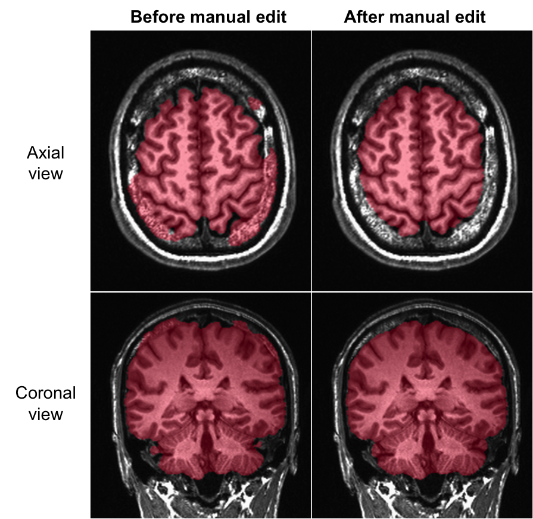

**The Neurofeedback Skull-stripped (NFBS) repository** is a database of 125 T1-weighted anatomical MRI scans that are manually skull-stripped. I addition to aiding in the processing and analysis of the NFB dataset, NFBS provides researchers with gold standard training and testing data for developing machine learning algorithms. The data was collected as a part of the [Enhanced Rockland Sample Neurofeedback Study](http://fcon_1000.projects.nitrc.org/indi/enhanced/).
For more information, please see:

Puccio et al. The Preprocessed Connectomes Project: repository of manually-corrected skull-stripped T1-weighted anatomical MRI data, *in submission*

## Download
- [NFBS skull-stripped images](https://fcp-indi.s3.amazonaws.com/data/Projects/RocklandSample/NFBS_Dataset.tar.gz) [1.9 GB]
- [NFBS BEaST library](https://fcp-indi.s3.amazonaws.com/data/Projects/RocklandSample/NFBS_BEaST_Library.tar) [1.9 GB]

 
 

## Contents of the repository

The repository contains data from 125 participants, 21 to 45 years old, with a variety of clinical and subclinical psychiatric symptoms. For each participant, the repository contains:

- Structural T1-weighted anonymized (de-faced) image
- Skull-stripped image
- Brain mask

The resolution of the images is 1 mm3 and each file is in NiFTI format (.nii.gz). In addition, the repository contains a BEaST library that is customized for the NFB dataset.

###Methods

The BEaST method[^1] (brain extraction based on nonlocal segmentation technique) was used to initially skull-strip the 125 anatomical T1-weighted images. This software uses a patch-based label fusion method that labels each voxel in the brain boundary volume by comparing it to similar locations in a library of segmented priors. The segmentation technique also incorporates a multi-resolution framework in order to reduce computational time. The version of BEaST used was 1.15.00 and our implementation was based off of a shell script written by Qingyang Li[^2]. Visual inspection of these initial skull-stripped images indicated whether additional edits were necessary.

Manual edits were performed using the Freeview visualization tool from the FreeSurfer software package[^3]. The standard for the NFBS was adapted from Eskildsen et al (2012). All exterior non-brain tissue was removed from the head image, specifically the skull, scalp, fat, muscle, dura mater, and external blood vessels and nerves. Time spent editing each mask ranged from 1–8 hours, depending on the quality of the anatomical image and the BEaST mask. Manually edited masks were added to the BEaST library, which was used to skull-strip the remaining datasets. This iterative technique was repeated until approximately 85 of the datasets were manually edited and all skull-strips were considered to be sufficient.

{:height="50%" width="50%" .center-image}

## Credits

#### NFB Contributors
- Benjamin Puccio, [Computational Neuroimaging Lab](http://computational-neuroimaging-lab.org), Center for Biomedical Imaging and Neuromodulation, Nathan S. Kline Institute for Psychiatric Research, Orangeburg, New York
- James Pooley, Center for the Developing Brain, Child Mind Institute, New York, New York
- John Pellman, Computational Neuroimaging Lab, Center for Biomedical Imaging and Neuromodulation, Nathan S. Kline Institute for Psychiatric Research, Orangeburg, New York, Center for the Developing Brain, Child Mind Institute, New York, New York
- Elise Taverna, Center for Biomedical Imaging and Neuromodulation, Nathan S. Kline Institute for Psychiatric Research, Orangeburg, New York
- R. Cameron Craddock, [Computational Neuroimaging Lab](http://computational-neuroimaging-lab.org), Center for Biomedical Imaging and Neuromodulation, Nathan S. Kline Institute for Psychiatric Research, Orangeburg, New York, Center for the Developing Brain, Child Mind Institute, New York, New York

#### Acknowledgements
We would like to thank Dr. Simon Fristed Eskildsen for help with the installation and optimization of the BEaST method. We would also like to acknowledge Qingyang Li for creating the BEaST guide, as well as the [Bash script](https://rpubs.com/conge/beast_intro) that we based our script on. Lastly, we would like to thank all of those involved in the participation, data collection, and data sharing initiative of the Enhanced Rockland Sample. This work was supported by R01MH101555 from the National Institute of Mental Health to RCC.

## References

[^1]: Eskildsen, S.F., Coupe, P., Fonov, V., Manjon, J.V., Leung, K.K., Guizard, N., Wassef, S.N., stergaard, L.R., Collins, D.L.: BEaST: Brain extraction based on nonlocal segmentation technique. NeuroImage 59(3), 2362-2373 (2012).doi:10.1016/j.neuroimage.2011.09.0125.
[^2]: A Brief Introduction to BEaST. [https://rpubs.com/conge/beast_intro](https://rpubs.com/conge/beast_intro).
[^3]: FreeSurfer Software Suite. [https://surfer.nmr.mgh.harvard.edu/](https://surfer.nmr.mgh.harvard.edu/).
